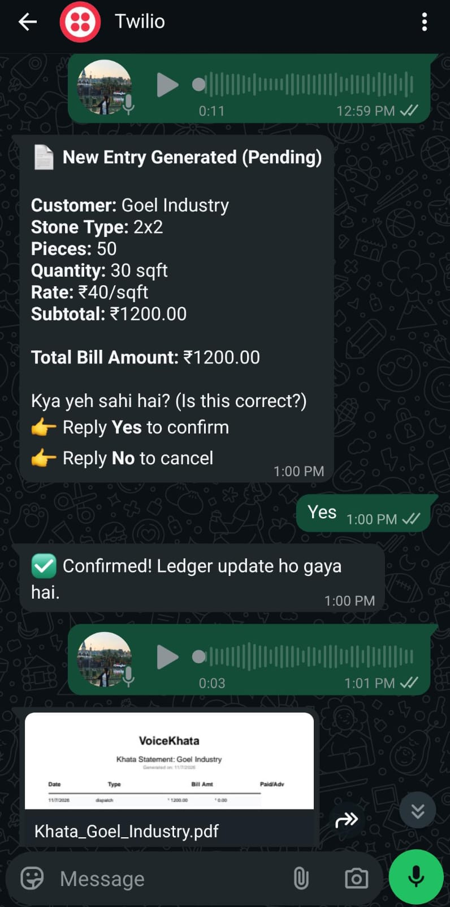
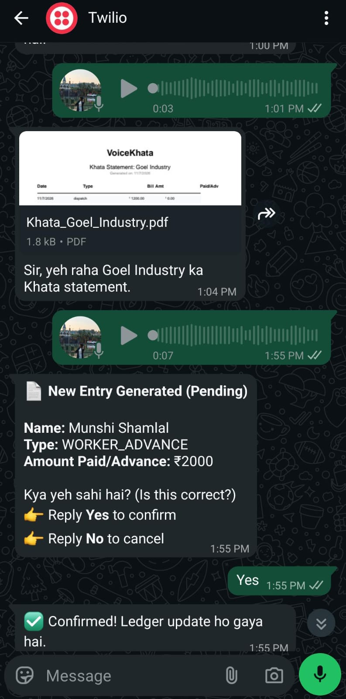
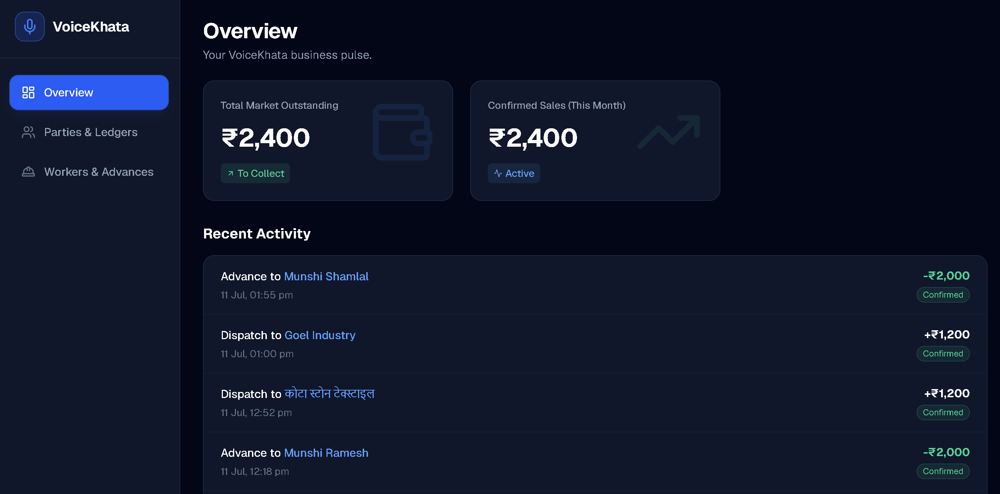
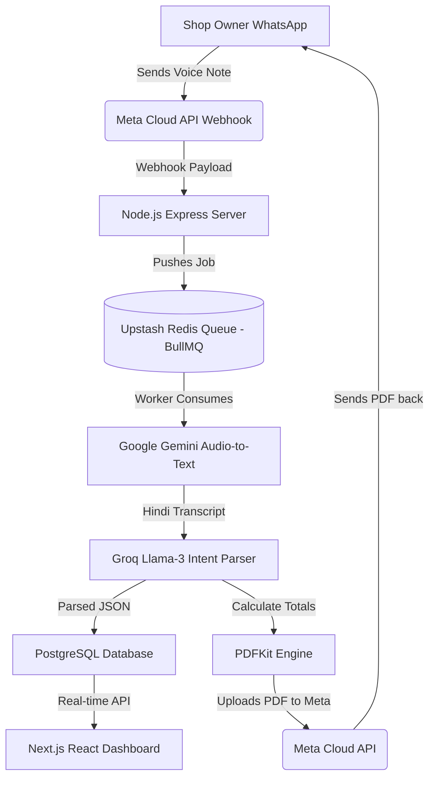

# 🎙️ VoiceKhata
**AI-Powered WhatsApp Ledger & Invoicing Engine for Local Indian Businesses**

> **Live Dashboard Demo:** [https://voice-khata.vercel.app/](https://voice-khata.vercel.app/)

VoiceKhata solves a critical problem for traditional Indian businesses (like stone merchants, wholesalers, and hardware shops): **Digital Record Keeping is too slow.** When a business owner is dealing with customers on the shop floor, they don't have time to open a laptop or navigate complex ERP software. 

VoiceKhata allows the shop owner to simply send a **Voice Note on WhatsApp** (in Hindi/English). The AI engine automatically transcribes the audio, parses the intent, calculates prices dynamically, records the transaction in a PostgreSQL ledger, and replies on WhatsApp with a professionally generated PDF Invoice.

---

## 📸 Project Showcase

### WhatsApp Bot Interface (Testing Phase via Twilio)
*Note: We leveraged the Twilio WhatsApp Sandbox API for our testing and rapid prototyping phase.*

  
  

### Next.js Analytics Dashboard

---

## 🏗️ High-Level Architecture

The system is fully decoupled, event-driven, and designed for high reliability.

---

## 🚀 Key Technical Features

### 1. Robust Webhook & Queue System
- Built a secure webhook endpoint for WhatsApp messaging (utilizing **Twilio** for the testing/prototyping phase and transitioning to Meta Cloud API).
- Implemented **BullMQ & Redis** to handle incoming webhook spikes asynchronously. This ensures the Express server always returns an immediate `200 OK` to Meta, preventing timeout loops and duplicate message deliveries.
- Implemented **Idempotency** using SHA-256 hashing on WhatsApp Message IDs to prevent double-processing during network retries.

### 2. Multi-Stage AI Pipeline
- **Audio Extraction:** Downloads OGG audio streams directly from Meta's encrypted media servers.
- **Transcription:** Streams the audio bytes into **Google Gemini Flash 1.5** for high-accuracy Hindi/English mixed-language transcription (e.g., *"Rajesh ko 2 by 2 pathar 35 rupaye ke hisaab se diya"*).
- **Intent Parsing:** Feeds the transcript into **Groq Llama-3 (8B)** using strict JSON schema enforcement to extract the structured `Intent` (`RECORD_SALE`, `UPDATE_PRICE`, `GET_PDF`), `Quantity`, `Item Name`, and `Party Name`.

### 3. Dynamic Pricing & Relational Database
- Engineered a normalized **PostgreSQL** schema (`parties`, `transactions`, `party_balances`, `price_list`).
- Implemented transactional integrity using `pg` pool.
- The AI doesn't hallucinate prices—it queries the live `price_list` table to dynamically calculate the grand total based on the extracted dimensions and quantities.

### 4. On-the-Fly PDF Generation
- Integrated **PDFKit** to programmatically draw professional, branded invoices (bills) entirely in memory (Buffers) without writing to disk.
- Uploads the in-memory PDF Buffer directly to the Meta Graph API as a media asset, then dispatches it back to the user's WhatsApp chat seamlessly.

### 5. Secure Admin Dashboard
- Built a sleek, responsive frontend using **Next.js**, **React**, and **Tailwind CSS**.
- Features an authentication layer using **JWT (JSON Web Tokens)** to secure the REST APIs.
- Displays real-time market outstanding balances and recent ledger entries.

---

## 🛠️ Technology Stack

* **Frontend:** Next.js (App Router), React, Tailwind CSS, Lucide React Icons
* **Backend:** Node.js, Express, TypeScript
* **Database:** PostgreSQL (Supabase)
* **Message Broker:** Redis (Upstash) + BullMQ
* **AI Models:** Google Gemini 3.5 Flash (Primary) / Gemini 1.5 Flash (Fallback)
* **External APIs:** Twilio WhatsApp API (Testing), Meta WhatsApp Cloud API (Production)

---
*Built with ❤️ for Indian Small Businesses.*
