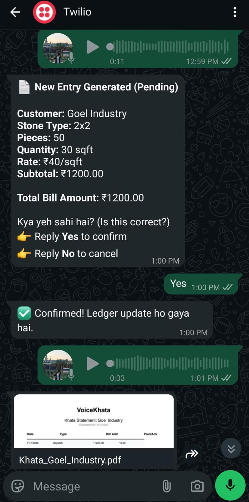
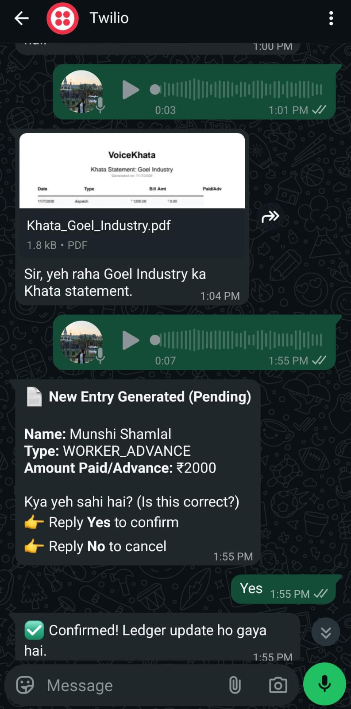
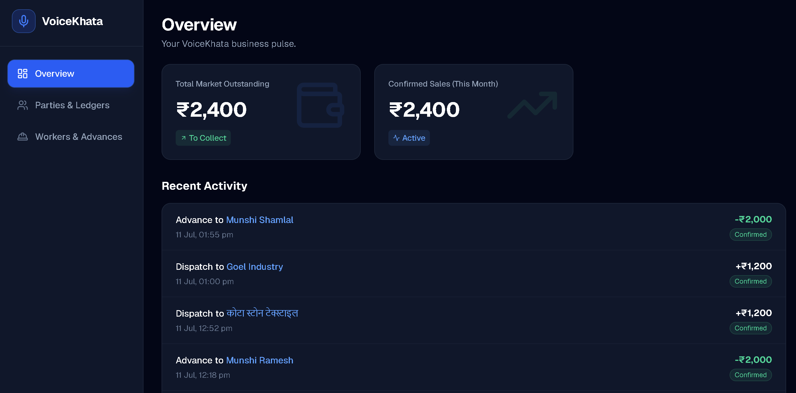
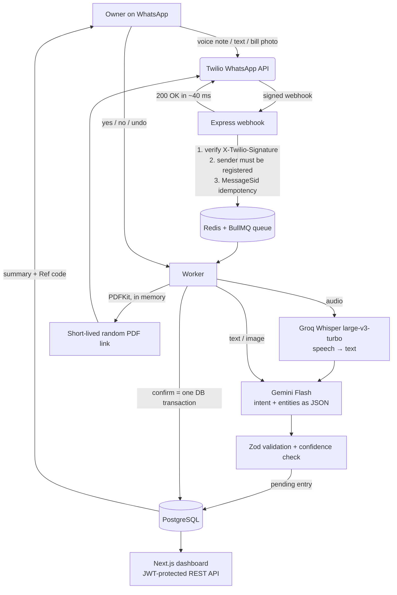

# 🎙️ VoiceKhata
**AI-powered WhatsApp ledger for local Indian businesses**


> **Live Dashboard Demo:** [https://voice-khata.vercel.app/](https://voice-khata.vercel.app/)

Traditional businesses (stone merchants, wholesalers, hardware shops) don't have time to open an ERP on the shop floor. With VoiceKhata the owner just sends a **WhatsApp voice note** in Hindi/Hinglish — *"Siddhi Stone ko 5000 sqft 2x1½ bheja, rate 31.5, loading 1500"* — and gets back a bill summary to confirm. After a "yes", the ledger is updated, and he can ask for a customer's khata or the price list as a PDF at any time.

Built for my father's stone trading business in Kota.

---

## 📸 Showcase

### WhatsApp bot (Twilio WhatsApp Sandbox)
<div style="display: flex; flex-wrap: wrap; gap: 20px;">
  
  
</div>

### Next.js dashboard


---

## 🏗️ Architecture


```mermaid
graph TD
    A[Owner on WhatsApp] -->|voice note / text / bill photo| B(Twilio WhatsApp API)
    B -->|signed webhook| C[Express webhook]
    C -->|1. verify X-Twilio-Signature<br/>2. sender must be registered<br/>3. MessageSid idempotency| D[(Redis + BullMQ queue)]
    C -->|200 OK in ~40 ms| B
    D --> E[Worker]
    E -->|audio| F[Groq Whisper large-v3-turbo<br/>speech → text]
    F --> G[Gemini Flash<br/>intent + entities as JSON]
    E -->|text / image| G
    G --> H[Zod validation + confidence check]
    H -->|pending entry| I[(PostgreSQL)]
    I -->|summary + Ref code| A
    A -->|"yes / no / undo"| E
    E -->|confirm = one DB transaction| I
    E -->|PDFKit, in memory| J[Short-lived random PDF link]
    J --> B
    I --> K[Next.js dashboard<br/>JWT-protected REST API]
```

**Message flow:** webhook → queue → (transcribe) → extract → validate → *pending* entry → owner replies **yes** → balances updated atomically. Nothing touches the ledger without a human confirmation.

---

## 🚀 Technical highlights

### Reliable webhook ingestion
- The webhook only verifies, deduplicates and enqueues, then answers Twilio immediately; all AI work runs in a **BullMQ** worker with exponential backoff and a rate limiter sized to Gemini's free tier.
- **Idempotency at three levels:** a `processed_messages` table (first writer wins on the Twilio `MessageSid`), the BullMQ `jobId`, and a unique index on `transactions.whatsapp_message_id`. Twilio retries never create duplicate entries.
- Jobs are processed strictly in arrival order so a quick "yes" can never overtake the voice note it confirms. If a job fails permanently, the owner is told on WhatsApp instead of hearing nothing.

### AI pipeline with guard-rails
- **Groq Whisper** (large-v3-turbo) transcribes Hindi/Hinglish audio; **Gemini Flash** returns intent + entities in JSON mode (primary and fallback models configurable).
- AI output is never trusted directly: a **Zod** schema cleans numbers ("₹1,50,000", "25 rupaye"), rejects negatives and absurd values, checks required fields per entry type, and rejects money-changing entries below a confidence threshold with a "please repeat" reply.
- The spoken rate is compared with the master **price list**; a large difference is flagged in the confirmation message.
- User text is passed to the model as delimited data with an instruction never to follow instructions inside it.

### Correct ledger
- All money math in **integer paise** (no floating-point drift); every bill component (loading, packing, tax, freight, stone type) is stored so any bill can be reconstructed.
- `yes` / `no` act on the **sender's own** pending entry (or a specific one via a 4-character reference code); pending entries expire after 24 h; `undo` reverses the last confirmed entry.
- Confirmation runs in a single PostgreSQL transaction with `SELECT … FOR UPDATE` and `INSERT … ON CONFLICT` upserts — concurrent confirmations cannot double-count.
- Fuzzy name matching with **pg_trgm** ("Sidhhi Stone" → existing "Siddhi Stone"); ambiguous khata requests get a "which one?" list instead of a guess.
- Every confirm, cancel, undo and price change is written to an **audit log**; price changes also to price history.

### Security
- Twilio **request-signature verification**; only registered phone numbers (per organisation) can use the bot — which is also what makes it multi-tenant.
- Media is downloaded only from `api.twilio.com` over HTTPS, and credentials are never forwarded to redirects (prevents SSRF / credential exfiltration).
- PDFs are generated in memory and served through **random 128-bit, 30-minute links** — never guessable file names.
- Startup **fails fast** if secrets are missing or weak; dashboard password stored as a **bcrypt** hash; login **rate-limited**; JWT algorithm pinned; CORS restricted to known origins; phone numbers masked in logs.

### PDFs for real customers
- PDFKit with an embedded Unicode font (renders **₹** correctly), IST dates, running balance, and automatic page breaks for long ledgers.

---

## 🧪 Testing

```bash
cd backend
npm test               # unit + integration tests (needs a local Postgres, see below)
npm run test:coverage  # with coverage report
npm run typecheck
```

- **156 tests** (Vitest + Supertest) — money math, validation, parsing, SSRF allow-list, PDF links, Gemini/Groq clients (mocked HTTP), the full ledger against a **real PostgreSQL**, the WhatsApp conversation flow, and webhook/API security (forged signatures, replayed messages, unknown senders, brute-force lockout, forged JWTs, CORS, org isolation).
- ~90 % line coverage of `backend/src`. CI runs typecheck, tests and build on every push.
- Tests use only `TEST_DATABASE_URL` (the name must contain "test") and never load `.env`, so they cannot touch real data.

**Load test** — webhook acknowledgement latency with real Postgres lookups:
```bash
npm run bench -- 2000 20      # requests, concurrency
```

**AI accuracy eval** — run the real extraction over a hand-labelled dataset:
```bash
npm run eval                  # uses eval/dataset.json (or the synthetic sample)
```
Prints intent accuracy, exact-match rate, per-field accuracy, how many wrong answers the validator caught, and p50/p95 latency.

---

## ⚙️ Running locally

```bash
docker compose up -d                       # Postgres :5432, Redis :6380
cd backend
cp .env.example .env                       # fill in secrets
npm install
npm run migrate                            # schema + migrations (idempotent)
npm run seed:prices                        # default stone price list
npm run add-member -- +91XXXXXXXXXX "Papa" owner   # allow a WhatsApp number
npm run dev

# in another terminal: send a signed fake WhatsApp message
npm run simulate -- +91XXXXXXXXXX "Ramesh se 5000 payment aaya"
npm run simulate -- +91XXXXXXXXXX "yes"
```

Frontend: `cd frontend && npm install && NEXT_PUBLIC_API_URL=http://localhost:3000/api npm run dev -- -p 3001`

See [`docs/DEPLOYING-HARDENING.md`](docs/DEPLOYING-HARDENING.md) before deploying this version over an existing installation.

---

## 🛠️ Stack

- **Frontend:** Next.js (App Router), React, Tailwind CSS
- **Backend:** Node.js, Express 5, TypeScript, Zod
- **Database:** PostgreSQL (Supabase) with pg_trgm
- **Queue:** Redis (Upstash) + BullMQ
- **AI:** Groq Whisper large-v3-turbo (speech-to-text), Google Gemini Flash (extraction)
- **Messaging:** Twilio WhatsApp API
- **Testing / CI:** Vitest, Supertest, GitHub Actions

---
*Built with ❤️ for Indian small businesses.*
